# Support New Targets

## Create a New Target

We could use rvpvp cli tool to create a new target.

```bash
$ rvpvp new new-target
```

It will create template files in the new created directory.

```bash
$ cd new-target
$ tree
.
├── isa
│   └── custom
│       └── insts.py
├── specs
│   └── custom
│       └── vmod_vv.spec.yml
└── target.yml
```

* `target.yml`: target configuration file.
* `isa`: directory to define new instruction model
* `specs`: directory to define new verification cases

Please read sections below for more information.

## Target Configuration File

The target configuration file is used to tell rvpvp how to generate, compile and
run verifcation cases.

The default file is defined as below, we could override variables for new targets.

```yaml
processor:
  xlen: 64
  flen: 64
  vlen: 1024
  elen: 64
  slen: 1024

compile:
  path: clang
  cc: f'{path} --target=riscv{xlen}-unknown-elf -mno-relax -fuse-ld=lld -march=rv{xlen}gv0p10zfh0p1 -menable-experimental-extensions'
  defines: f'-DXLEN={xlen} -DVLEN={vlen}'
  cflags: -g -static -mcmodel=medany -fvisibility=hidden -nostdlib -nostartfiles
  linkflags: ''

spike:
  path: spike

# gem5:
#   path: ~/work/gem5/gem5/build/RISCV/gem5.opt
#   config: ~/work/gem5/gem5/configs/example/fs.py
```

## Add New Instructions

To support new instructions, we should create a new `Inst` python class in `isa/`
directory.

The new class inherits from the `Inst` class and should override these members
and methods:

 - `name` : the instruction assembly name string
 - `golden()`: return the inst running result, usually the dest operator value
   computed from the source operators.

This is a simple `add` instruction example:

```python
# isa/rvi/add.py
from rvpvp.isa.inst import Inst

class Add(Inst):
    name = 'add'

    def golden(self):
        rd = self['rs1'] + self['rs2']
        return rd
```

To support risc-v vector instructions, our vector inst model will receive
numpy's ndarray for vector operators. For example, a `vadd.vv` model without
mask could be defined as below.

```python
# isa/rvv/vadd_vv.py
from rvpvp.isa.inst import Inst

class Vadd_vv(Inst):
    name = 'vadd.vv'

    # vadd.vv vd, vs2, vs1
    def golden(self):
        vd = self['vs2'] + self['vs1']
        return vd
```

## Add Verification Cases

Verification cases should be added in the `spec/` directory.

The detailed syntax is defined in [Verification Case Specification](../reference/spec).

## Generate and Run

The target verification cases could be generated once the target cases are ready.

```bash
$ rvpvp gen
```

And then, we could run the generated cases.

```bash
$ rvpvp run -n 80
```

The ISS and RTL simulator co-simulation flow are shown below.

